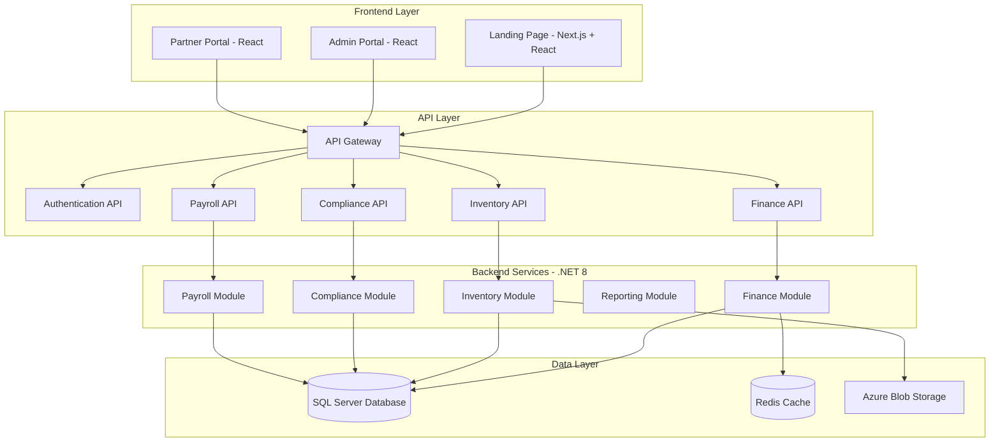
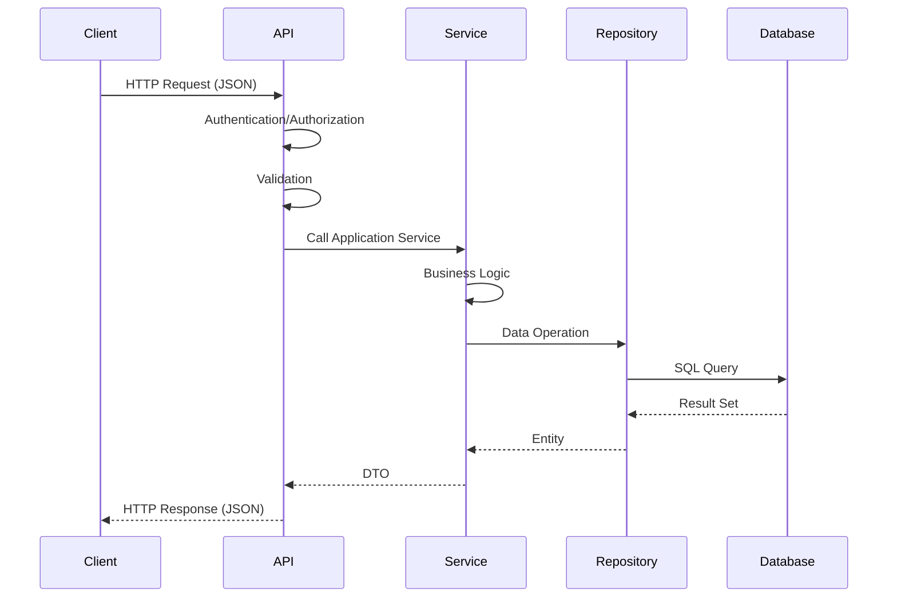
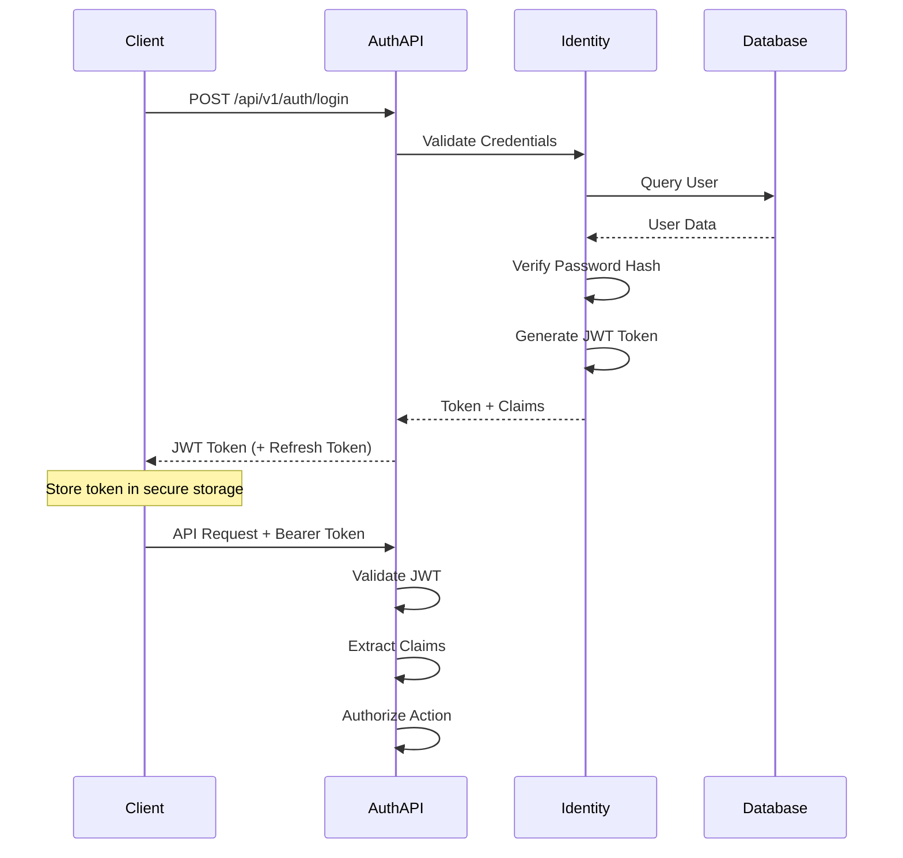
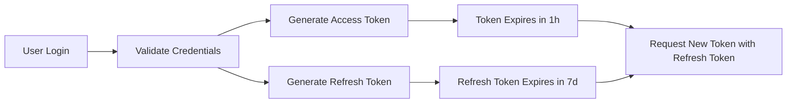
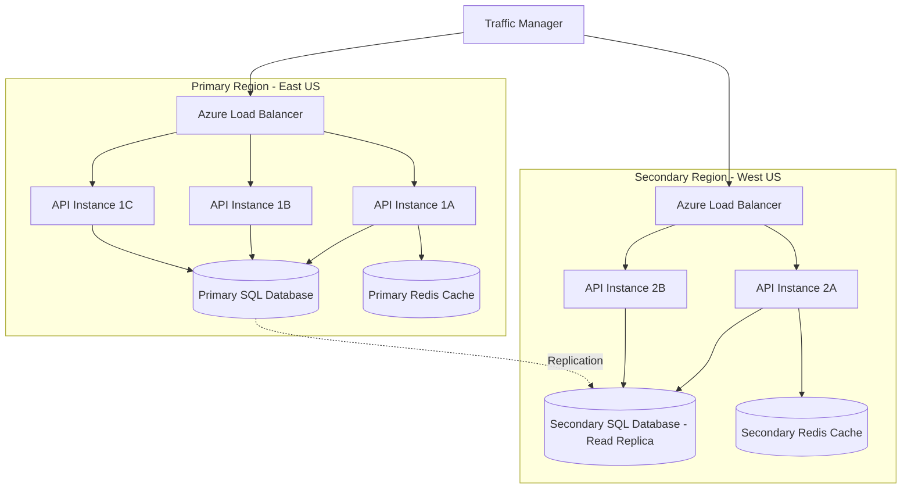

# JERP 3.0 - System Architecture Documentation

## Table of Contents
- [System Architecture Overview](#system-architecture-overview)
- [Technology Stack](#technology-stack)
- [Data Flow and Integration Patterns](#data-flow-and-integration-patterns)
- [Security Architecture](#security-architecture)
- [Deployment Architecture](#deployment-architecture)

---

## System Architecture Overview

JERP 3.0 is a comprehensive Cannabis ERP system built with a modern, scalable architecture using .NET 8 backend and React frontend.

### High-Level Architecture Diagram



### Architecture Layers

#### 1. Presentation Layer
- **Landing Page**: Next.js-based marketing and public-facing portal
- **Admin Portal**: Full-featured administrative interface for system management
- **Partner Portal**: Vendor and customer self-service portal

#### 2. API Layer
- **RESTful APIs**: JSON-based HTTP APIs following OpenAPI specifications
- **Authentication Service**: JWT-based authentication and authorization
- **Module-specific APIs**: Dedicated endpoints for Finance, Inventory, Compliance, and Payroll

#### 3. Application Layer
- **Business Logic**: Application services implementing business rules
- **DTOs**: Data transfer objects for API communication
- **Validation**: Input validation and business rule enforcement
- **Mapping**: AutoMapper for entity-DTO transformations

#### 4. Domain Layer
- **Entities**: Core business entities (Account, JournalEntry, Employee, Product, etc.)
- **Enums**: Type-safe enumeration types
- **Interfaces**: Contracts for repositories and services
- **Domain Logic**: Core business rules and constraints

#### 5. Infrastructure Layer
- **Data Access**: Entity Framework Core with SQL Server
- **Repositories**: Data access implementations
- **External Services**: Integration with third-party systems
- **Caching**: Redis caching implementation
- **File Storage**: Azure Blob Storage for documents

---

## Technology Stack

### Backend Technologies

#### Core Framework
- **.NET 8**: Latest LTS version of .NET
- **ASP.NET Core Web API**: RESTful API framework
- **C# 12**: Latest C# language features

#### Data Access
- **Entity Framework Core 8**: ORM with Code-First approach
- **Microsoft SQL Server**: Primary relational database (Express 2019+)
- **Npgsql** (optional): PostgreSQL support for alternative deployments

#### Caching and Performance
- **Redis**: Distributed caching for sessions and frequently accessed data
- **In-Memory Caching**: ASP.NET Core memory cache for local caching

#### Authentication & Security
- **ASP.NET Core Identity**: User management and authentication
- **JWT (JSON Web Tokens)**: Token-based authentication
- **BCrypt/PBKDF2**: Password hashing
- **CORS**: Cross-origin resource sharing policies

#### Testing
- **xUnit**: Unit testing framework
- **Moq**: Mocking framework
- **FluentAssertions**: Assertion library
- **Bogus**: Fake data generation

### Frontend Technologies

#### Core Framework
- **Next.js 14**: React framework with SSR support
- **React 18+**: UI component library
- **TypeScript**: Type-safe JavaScript

#### UI Libraries
- **Tailwind CSS**: Utility-first CSS framework
- **shadcn/ui**: Component library built on Radix UI
- **Lucide Icons**: Icon library
- **Recharts**: Data visualization library

#### State Management
- **React Context API**: Global state management
- **React Hooks**: Local state management
- **TanStack Query**: Server state management

#### Development Tools
- **Vite**: Fast build tool
- **ESLint**: Code linting
- **Prettier**: Code formatting
- **TypeScript ESLint**: TypeScript-specific linting

#### Testing
- **React Testing Library**: Component testing
- **Jest**: Testing framework
- **Playwright**: E2E testing

### DevOps & Infrastructure

#### Containerization
- **Docker**: Container platform
- **Docker Compose**: Multi-container orchestration

#### CI/CD
- **GitHub Actions**: Automated workflows
- **GitHub Packages**: Package registry

#### Cloud Platform (Production)
- **Azure App Service**: Web application hosting
- **Azure SQL Database**: Managed SQL Server
- **Azure Redis Cache**: Managed Redis instance
- **Azure Blob Storage**: Object storage
- **Azure Application Insights**: Application monitoring

#### Monitoring & Logging
- **Serilog**: Structured logging
- **Application Insights**: Performance monitoring
- **Azure Monitor**: Infrastructure monitoring

---

## Data Flow and Integration Patterns

### API Communication Patterns

#### Request/Response Flow


#### Authentication Flow


### Data Persistence Patterns

#### Repository Pattern
- **Generic Repository**: Base repository with common CRUD operations
- **Specialized Repositories**: Domain-specific repositories with custom queries
- **Unit of Work**: Transaction management across multiple repositories

#### Entity Framework Core Strategy
- **Code-First Migrations**: Database schema management
- **Fluent API Configuration**: Entity configuration with type safety
- **Query Optimization**: 
  - Eager loading with `.Include()`
  - Projection with `.Select()`
  - AsNoTracking for read-only queries
  - Compiled queries for frequently executed queries

### Caching Strategy

#### Cache Layers
1. **Client-Side Caching**: Browser cache for static assets
2. **Redis Distributed Cache**: 
   - Chart of Accounts (1 hour TTL)
   - User sessions (configurable TTL)
   - Lookup data (departments, account types)
3. **In-Memory Cache**: 
   - Configuration settings
   - Frequently accessed reference data

#### Cache Invalidation
- **Time-based expiration**: TTL for each cache entry
- **Event-based invalidation**: Clear cache on data modification
- **Cache-aside pattern**: Load from DB if cache miss

### File Storage Pattern

#### Azure Blob Storage
- **Document Storage**: Invoices, receipts, compliance documents
- **Structure**: `{tenant-id}/{module}/{year}/{month}/{document-id}.{ext}`
- **Access**: Shared Access Signatures (SAS) with expiration
- **Retention**: Configurable retention policies per document type

### Real-time Updates (Future Enhancement)

#### SignalR Integration
- **Real-time Notifications**: System alerts, compliance warnings
- **Live Dashboard Updates**: KPI metrics, pending approvals
- **Collaboration Features**: Multi-user editing notifications

---

## Security Architecture

### Authentication & Authorization

#### JWT Token-Based Authentication


**Token Claims:**
- User ID
- Username
- Email
- Roles (Admin, Manager, User, Partner)
- Tenant ID (for multi-tenancy)
- Permissions (granular access control)

#### Role-Based Access Control (RBAC)

**System Roles:**
1. **Super Admin**: Full system access, tenant management
2. **Admin**: Full access within tenant, user management
3. **Finance Manager**: Finance module full access
4. **Inventory Manager**: Inventory module full access
5. **Compliance Officer**: Compliance module full access
6. **Accountant**: Finance module read/write
7. **User**: Basic read access
8. **Partner**: Limited vendor/customer portal access

**Permission Model:**
- Module-based permissions (Finance, Inventory, Compliance)
- Action-based permissions (Read, Create, Update, Delete, Approve)
- Data-based permissions (Own data, Department data, All data)

### Data Protection

#### Data in Transit
- **TLS 1.3**: All HTTP traffic encrypted
- **Certificate Pinning**: Mobile apps validate server certificates
- **HSTS**: HTTP Strict Transport Security enabled
- **Secure Cookies**: HttpOnly, Secure, SameSite attributes

#### Data at Rest
- **Database Encryption**: Transparent Data Encryption (TDE) in production
- **Encrypted Connection Strings**: Azure Key Vault for secrets
- **Password Hashing**: ASP.NET Core Identity with PBKDF2
  - Minimum 10,000 iterations
  - Salted hashes stored in database
- **Sensitive Data Encryption**: AES-256 for PII fields

### API Security

#### Input Validation
- **Model Validation**: Data annotations on DTOs
- **Business Rule Validation**: FluentValidation for complex rules
- **SQL Injection Prevention**: Parameterized queries via EF Core
- **XSS Prevention**: Output encoding, Content Security Policy

#### Rate Limiting
- **Global Rate Limit**: 1000 requests per minute per IP
- **Authenticated Rate Limit**: 2000 requests per minute per user
- **Endpoint-Specific Limits**: Stricter limits on sensitive operations

#### CORS Policy
- **Allowed Origins**: Configured per environment
- **Allowed Methods**: GET, POST, PUT, DELETE
- **Allowed Headers**: Authorization, Content-Type
- **Credentials**: Allowed for authenticated requests

### Cannabis Industry Compliance

#### 280E Tax Compliance
- **COGS Tracking**: Detailed cost of goods sold tracking
- **Non-Deductible Expenses**: Flagging of non-deductible expenses per IRS 280E
- **Audit Trail**: Complete transaction history for tax audits

#### State Regulatory Compliance
- **License Tracking**: Monitor license expiration and renewals
- **Metrc Integration**: State traceability system integration
- **Seed-to-Sale Tracking**: Complete product lifecycle tracking
- **Batch Tracking**: Lot numbers, expiration dates, testing results

### Audit Logging

#### Comprehensive Audit Trails
- **Financial Transactions**: All journal entries, payments, invoices
- **User Actions**: Login attempts, permission changes, data modifications
- **System Events**: Configuration changes, integration errors
- **Data Retention**: 7 years for financial records (SOX compliance)

#### Audit Log Contents
- **Who**: User ID, username, IP address
- **What**: Action performed, entity type, entity ID
- **When**: Timestamp (UTC)
- **Where**: Module, endpoint, client info
- **Result**: Success/failure, error details

---

## Deployment Architecture

### Development Environment

#### Local Docker Development
```yaml
# docker-compose.yml
services:
  api:
    - .NET 8 API
    - Hot reload enabled
    - Port 5000
  
  frontend:
    - Next.js development server
    - Port 3000
  
  sqlserver:
    - SQL Server 2019 Express
    - Persistent volume
    - Port 1433
  
  redis:
    - Redis 7
    - Port 6379
```

**Development Workflow:**
1. Clone repository
2. Run `docker-compose up`
3. Apply migrations: `dotnet ef database update`
4. Access Swagger UI: `http://localhost:5000`
5. Access frontend: `http://localhost:3000`

### Staging Environment

#### Azure App Service (Staging Slot)
- **Web App**: Linux container with .NET 8 runtime
- **Database**: Azure SQL Database (S1 tier)
- **Cache**: Azure Redis Cache (Basic tier)
- **Storage**: Azure Blob Storage (Standard tier)

**Configuration:**
- Deployment via GitHub Actions
- Separate connection strings and secrets
- Feature flags for testing new features
- Smoke tests after deployment

### Production Environment

#### Multi-Region Azure Deployment



**Production Infrastructure:**
- **Azure Traffic Manager**: Geographic load balancing
- **Azure Load Balancer**: Layer 4 load balancing within regions
- **API Instances**: Auto-scaling based on CPU/memory (2-10 instances)
- **Azure SQL Database**: 
  - Primary: Premium tier (P2) with 250 DTUs
  - Secondary: Read replica for reporting
  - Geo-replication for disaster recovery
  - Automated backups (35-day retention)
- **Azure Redis Cache**: Premium tier (6GB) with clustering
- **Azure Blob Storage**: Geo-redundant storage (GRS)

### Database Architecture

#### High Availability
- **Active Geo-Replication**: Secondary region read replica
- **Automatic Failover Groups**: Auto-failover in case of regional outage
- **Backup Strategy**:
  - Automated backups every 5 minutes
  - Point-in-time restore (35 days)
  - Long-term retention (7 years for compliance)

#### Performance Optimization
- **Connection Pooling**: Min 10, Max 100 connections per instance
- **Query Performance Insights**: Automatic query tuning recommendations
- **Indexes**: 
  - Clustered indexes on primary keys
  - Non-clustered indexes on foreign keys and frequently queried columns
  - Filtered indexes for common query patterns

#### Scaling Strategy
- **Vertical Scaling**: Increase DTUs during peak hours
- **Read Scale-Out**: Route read-only queries to replica
- **Partitioning**: Future consideration for large tenants

### Monitoring and Observability

#### Application Insights
- **Performance Metrics**: Response times, throughput, failure rates
- **Custom Metrics**: Business KPIs, module-specific metrics
- **Dependency Tracking**: Database, Redis, external API calls
- **Exception Tracking**: Detailed error logs with stack traces

#### Azure Monitor
- **Infrastructure Metrics**: CPU, memory, disk, network
- **Alerts**: Automated alerts for anomalies and thresholds
- **Log Analytics**: Centralized logging and querying
- **Availability Tests**: Synthetic monitoring from multiple regions

#### Logging Strategy
- **Structured Logging**: Serilog with JSON formatting
- **Log Levels**: 
  - Error: Exceptions and critical failures
  - Warning: Potential issues, degraded performance
  - Information: Key business events, API calls
  - Debug: Detailed diagnostic information (dev only)
- **Log Sinks**: 
  - Console (development)
  - Application Insights (production)
  - Azure Blob Storage (long-term retention)

### Scalability Considerations

#### Horizontal Scaling
- **Stateless API**: All API instances are identical and stateless
- **Session State**: Stored in Redis for sharing across instances
- **File Uploads**: Direct to Azure Blob Storage via SAS tokens
- **Background Jobs**: Azure Functions or Hangfire with distributed locking

#### Performance Optimization
- **CDN**: Azure CDN for static assets and frontend
- **Response Compression**: Gzip compression for API responses
- **Output Caching**: Cache frequent queries with short TTL
- **Database Optimization**: 
  - Query optimization with execution plans
  - Index tuning based on query patterns
  - Periodic statistics updates

#### Cost Optimization
- **Auto-scaling**: Scale down during off-peak hours
- **Reserved Instances**: 1-3 year reservations for cost savings
- **Spot Instances**: For non-critical background processing
- **Tiered Storage**: Hot/Cool/Archive tiers based on access patterns

---

## Related Documentation

- [SCOPE-OF-WORK.md](./SCOPE-OF-WORK.md) - Project scope and feature breakdown
- [DEVELOPER-ONBOARDING.md](./DEVELOPER-ONBOARDING.md) - Developer setup and workflow
- [API-DOCUMENTATION.md](../API-DOCUMENTATION.md) - API endpoint documentation
- [TESTING-GUIDE.md](../TESTING-GUIDE.md) - Testing strategies and examples
- [DOCKER-DEPLOYMENT.md](../DOCKER-DEPLOYMENT.md) - Docker deployment guide
- [FINANCE-MODULE-IMPLEMENTATION.md](../FINANCE-MODULE-IMPLEMENTATION.md) - Finance module details
- [INVENTORY-MODULE-IMPLEMENTATION.md](../INVENTORY-MODULE-IMPLEMENTATION.md) - Inventory module details

---

**Document Version:** 1.0  
**Last Updated:** February 5, 2026  
**Maintained By:** JERP Development Team
