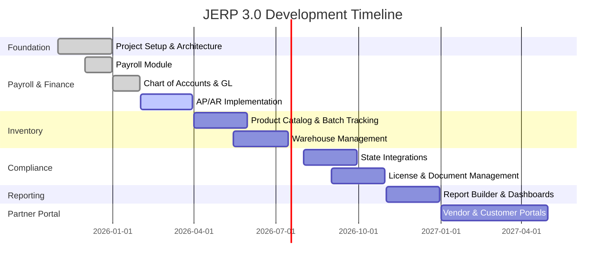

# JERP 3.0 - Project Scope of Work

## Table of Contents
- [Executive Summary](#executive-summary)
- [Feature Breakdown by Module](#feature-breakdown-by-module)
- [Development Phases and Milestones](#development-phases-and-milestones)
- [Resource Requirements](#resource-requirements)
- [Timeline Estimates](#timeline-estimates)

---

## Executive Summary

### Project Overview

**JERP 3.0** is a comprehensive Enterprise Resource Planning system specifically designed for cannabis businesses. The system provides financial management, payroll, inventory tracking, compliance monitoring, and multi-tenant capabilities to support cannabis dispensaries, cultivators, and distributors.

### Key Objectives

1. **Financial Compliance**: Provide FASB ASC-compliant financial accounting with comprehensive chart of accounts and general ledger capabilities
2. **Cannabis Tax Compliance**: Support IRS 280E tax compliance for cannabis businesses with COGS tracking and non-deductible expense identification
3. **Inventory Traceability**: Track inventory with batch/lot traceability for seed-to-sale compliance
4. **State Compliance**: Integrate with state traceability systems (Metrc, BioTrack, Leaf Data Systems)
5. **Multi-Tenant Architecture**: Enable SaaS deployment with complete tenant isolation
6. **Payroll Management**: Comprehensive payroll processing with timesheet tracking and compliance
7. **Partner Collaboration**: Offer partner portal for vendor/customer collaboration and self-service

### Target Market

**Primary Customers:**
- Cannabis dispensaries (retail)
- Cannabis cultivators (grow operations)
- Cannabis distributors
- Cannabis manufacturers/processors
- Multi-location cannabis enterprises

**Market Size:**
- US cannabis market: $30B+ (2026 estimate)
- Target: 5% market share in cannabis ERP segment
- Pricing: $199-$999/month per location

### Business Model

- **SaaS Subscription**: Monthly/annual subscriptions per location
- **Tiered Pricing**: 
  - Starter: $199/month (single location, basic features)
  - Professional: $499/month (up to 3 locations, advanced features)
  - Enterprise: $999+/month (unlimited locations, full features, custom integrations)
- **Add-ons**: Additional modules, integrations, premium support
- **Implementation Services**: One-time setup and training fees

### Success Metrics

**Technical Metrics:**
- System uptime: 99.9% availability
- API response time: <200ms for 95% of requests
- Database query performance: <100ms for 90% of queries
- Bug resolution: Critical bugs fixed within 24 hours

**Business Metrics:**
- Customer acquisition: 50 paying customers in first year
- Customer retention: 90%+ annual retention rate
- User satisfaction: NPS score >50
- Revenue: $500K ARR by end of year 1

---

## Feature Breakdown by Module

### 1. Finance Module

#### Chart of Accounts
- **FASB ASC Topic/Subtopic Tracking**: Full support for FASB accounting standards
- **Account Types**: Asset, Liability, Equity, Revenue, Expense
- **Account Sub-Types**: 30+ sub-classifications (Current Assets, Fixed Assets, etc.)
- **Account Hierarchy**: Multi-level parent-child account structure
- **Account Status**: Active, inactive, archived accounts
- **Custom Fields**: Industry-specific fields (cannabis product codes, license numbers)

#### General Ledger
- **Double-Entry Bookkeeping**: Automatic debit/credit balancing
- **Journal Entries**: Manual and system-generated entries
- **Entry Types**: Opening balance, adjusting, closing, reversing entries
- **Batch Posting**: Post multiple entries simultaneously
- **Entry Approval Workflow**: Draft → Review → Approved → Posted
- **Void/Reverse Entries**: Audit-trail preserving reversal mechanism
- **Multi-Currency Support**: Future enhancement for international operations

#### Accounts Payable (AP)
- **Vendor Management**: 
  - Vendor profiles with contact information
  - Vendor categories and payment terms
  - 1099 vendor tracking
  - Vendor performance metrics
- **Bill Entry**:
  - Manual bill entry with line items
  - OCR scanning for automated data extraction (future)
  - Multi-line bills with different accounts/tax codes
  - Attachments (PDF invoices, receipts)
- **Bill Approval Workflow**:
  - Configurable approval chains
  - Email notifications
  - Approval history tracking
- **Payment Processing**:
  - Check printing with MICR encoding
  - ACH/EFT payment generation
  - Credit card payments
  - Batch payment runs
  - Payment reconciliation
- **Aging Reports**:
  - AP aging by vendor (30/60/90/120+ days)
  - Cash requirements forecast
  - Vendor payment history

#### Accounts Receivable (AR)
- **Customer Management**:
  - Customer profiles with credit limits
  - Customer categories (retail, wholesale, medical, recreational)
  - Customer tax exemptions
  - Customer purchase history
- **Invoice Generation**:
  - Professional invoice templates
  - Recurring invoices (subscription billing)
  - Batch invoicing
  - Email delivery with PDF attachment
- **Invoice Line Items**:
  - Product/service descriptions
  - Quantity, unit price, discounts
  - Tax calculations (sales tax, excise tax)
  - Cannabis-specific taxes (cultivation tax, retail tax)
- **Payment Processing**:
  - Cash payments with cash handling compliance
  - Check deposits
  - Credit card processing integration
  - ACH payment collection
  - Payment application (full, partial, write-off)
- **Aging Reports**:
  - AR aging by customer (30/60/90/120+ days)
  - Collection effectiveness metrics
  - Bad debt write-offs

#### Financial Reporting
- **Profit & Loss Statement (P&L)**:
  - Standard P&L with revenue, COGS, expenses
  - Comparative periods (month-over-month, year-over-year)
  - Variance analysis
  - Departmental P&L
  - 280E compliant formatting (COGS vs. non-deductible)
- **Balance Sheet**:
  - Standard balance sheet (assets, liabilities, equity)
  - Comparative periods
  - Financial ratios (current ratio, debt-to-equity)
  - Working capital analysis
- **Cash Flow Statement**:
  - Operating, investing, financing activities
  - Direct and indirect methods
  - Cash position forecasting
- **Trial Balance**:
  - Unadjusted and adjusted trial balances
  - Period-end closing reports
- **Budget vs. Actual**:
  - Budget entry and tracking
  - Variance reporting
  - Budget adjustments and revisions
- **Custom Reports**:
  - Report designer with drag-drop fields
  - Saved report templates
  - Scheduled report delivery

#### 280E Tax Compliance
- **COGS Tracking**:
  - Direct labor costs
  - Direct materials (cannabis inventory)
  - Overhead allocation
- **Non-Deductible Expense Classification**:
  - Automatic flagging of 280E non-deductible expenses
  - Marketing and advertising expenses
  - Administrative expenses
- **280E Tax Reports**:
  - Schedule C supplement for 280E businesses
  - COGS detail report
  - Non-deductible expense report
  - Year-end tax package preparation

### 2. Payroll Module (Existing)

#### Employee Management
- Employee profiles with personal information
- Employment history and status tracking
- Department and position assignments
- Pay rate management (hourly, salary)
- Tax withholding configuration (W-4 information)

#### Timesheet Tracking
- Time entry (clock in/out)
- Time approval workflow
- Overtime calculation
- PTO tracking and accrual
- Timesheet reports

#### Payroll Processing
- Automated payroll calculation
- Federal and state tax withholding
- FICA, Medicare, unemployment taxes
- Deductions (health insurance, 401k, garnishments)
- Net pay calculation
- Direct deposit file generation
- Pay stub generation

#### Payroll Reports
- Payroll summary reports
- Payroll register
- Tax liability reports
- Quarterly tax reports (941, state)
- Year-end W-2 generation

#### Payroll-Finance Integration
- Automatic journal entries for payroll expenses
- Payroll liability tracking
- Payroll tax accruals
- Department cost allocation

### 3. Inventory Module

#### Product Catalog
- **Product Master**:
  - Product names, descriptions, SKUs
  - Product categories (flower, edibles, concentrates, etc.)
  - Product variants (size, strain, potency)
  - UPC/barcode management
  - Product images and specifications
- **Cannabis-Specific Attributes**:
  - Strain information (Indica, Sativa, Hybrid)
  - THC/CBD percentages
  - Terpene profiles
  - Testing results (potency, pesticides, microbials)
- **Pricing Management**:
  - Retail pricing by customer category
  - Wholesale pricing tiers
  - Promotional pricing and discounts
  - Price history tracking

#### Batch/Lot Tracking
- **Batch Creation**:
  - Unique batch/lot numbers
  - Production date and expiration date
  - Quantity produced
  - Source cultivation/manufacturing details
- **Seed-to-Sale Tracking**:
  - Complete lifecycle from plant to sale
  - State package ID integration (Metrc)
  - Transfer tracking between facilities
- **Quality Control**:
  - Lab testing results attachment
  - Pass/fail status
  - Quarantine and hold management
- **Traceability**:
  - Genealogy tracking (parent batches)
  - Consumer-facing batch lookup

#### Warehouse Management
- **Multi-Location Support**:
  - Multiple warehouses/facilities
  - Location-specific inventory
  - Inter-location transfers
- **Bin/Zone Management**:
  - Warehouse zones and bin locations
  - Picking zones for order fulfillment
  - Quarantine zones for testing
- **Receiving**:
  - Purchase order receiving
  - Quantity verification
  - Quality inspection
  - Put-away process
- **Shipping**:
  - Sales order picking
  - Packing and shipping
  - Delivery tracking
  - State compliance manifest generation

#### Stock Movements
- **Adjustments**:
  - Physical inventory adjustments
  - Shrinkage and waste tracking
  - Damage and spoilage recording
  - Audit trail for all adjustments
- **Transfers**:
  - Inter-location transfers
  - Transfer approval workflow
  - In-transit inventory tracking
- **Cycle Counts**:
  - Scheduled cycle counting
  - ABC analysis for count frequency
  - Variance reporting and investigation

#### Inventory Valuation
- **Costing Methods**:
  - FIFO (First In, First Out)
  - LIFO (Last In, First Out)
  - Average Cost
  - Standard Cost
- **Valuation Reports**:
  - Inventory valuation summary
  - COGS calculation for 280E compliance
  - Inventory aging report
  - Slow-moving and obsolete inventory

#### Inventory Reports
- Stock status report (on-hand, allocated, available)
- Low stock alerts and reorder points
- Inventory turnover analysis
- Batch expiration tracking
- Stock movement history

### 4. Compliance Module

#### State Compliance Integration
- **Metrc Integration** (Colorado, Michigan, etc.):
  - Package creation and tracking
  - Transfer manifest submission
  - Sales reporting
  - Plant tracking
  - Waste tracking
- **BioTrack Integration** (Washington, New Mexico, etc.):
  - Inventory sync
  - Transfer reporting
  - Manifest generation
- **Leaf Data Systems** (Washington):
  - Lab result submission
  - Inventory reporting
- **API-Based Integration**:
  - Real-time data sync
  - Error handling and retry logic
  - Sync status dashboard

#### License Management
- **License Tracking**:
  - Business licenses (retail, cultivation, manufacturing)
  - Individual employee licenses (badge tracking)
  - License expiration monitoring
  - Renewal reminders and workflow
- **License Documents**:
  - Digital license copies
  - Document expiration tracking
  - Renewal application management

#### Regulatory Document Management
- **Document Repository**:
  - SOPs (Standard Operating Procedures)
  - Compliance policies
  - Training materials
  - Audit reports
- **Document Version Control**:
  - Version history tracking
  - Document approval workflow
  - Employee acknowledgment tracking
- **Document Retention**:
  - Retention policies by document type
  - Automated retention enforcement
  - Archival and disposal tracking

#### Audit Trail & Reporting
- **Comprehensive Audit Logs**:
  - All data changes tracked (who, what, when)
  - User activity logs
  - System access logs
  - Failed login attempts
- **Compliance Reports**:
  - State-specific compliance reports
  - Internal audit reports
  - Exception reports (policy violations)
- **Compliance Alerts**:
  - License expiration warnings
  - Policy violation notifications
  - Unusual activity alerts
  - Failed integration sync alerts

### 5. Reporting & Analytics Module

#### Dashboard
- **KPI Widgets**:
  - Revenue (daily, weekly, monthly, YTD)
  - Gross profit margin
  - Inventory value
  - Cash position
  - Pending approvals count
- **Charts and Visualizations**:
  - Revenue trend charts (Recharts)
  - Inventory turnover charts
  - AP/AR aging charts
  - Compliance score gauge
- **Configurable Dashboards**:
  - Role-based default dashboards
  - Customizable widget layout
  - Dashboard sharing

#### Custom Report Builder
- **Drag-and-Drop Designer**:
  - Select entities and fields
  - Apply filters and sorting
  - Group and summarize data
  - Add calculations and formulas
- **Report Templates**:
  - Pre-built templates for common reports
  - User-saved templates
  - Template marketplace (future)
- **Output Formats**:
  - PDF with professional formatting
  - Excel with data and formatting
  - CSV for data import
  - HTML for web viewing

#### Scheduled Reports
- **Report Scheduling**:
  - Daily, weekly, monthly schedules
  - Specific day/time execution
  - Conditional execution (if data exists)
- **Distribution**:
  - Email delivery to multiple recipients
  - Saved to document repository
  - API webhook notification
- **Report History**:
  - Archive of generated reports
  - Report regeneration on-demand

### 6. Admin Portal

#### User Management
- **User Accounts**:
  - User creation and deactivation
  - Password management and resets
  - Multi-factor authentication (MFA) setup
  - User profile management
- **Role Management**:
  - Pre-defined system roles
  - Custom role creation
  - Role permission matrix
  - Role assignment to users
- **Permission Management**:
  - Granular permissions by module and action
  - Data-level permissions (own, department, all)
  - Permission inheritance
  - Permission auditing

#### Tenant Management (Multi-Tenancy)
- **Tenant Provisioning**:
  - New tenant creation with isolated database schema
  - Tenant configuration (company info, logo, branding)
  - Tenant-specific settings
- **Tenant Administration**:
  - Tenant user limits
  - Feature flag management per tenant
  - Tenant billing and subscription management
  - Tenant deactivation and data retention
- **Data Isolation**:
  - Complete tenant data separation
  - No cross-tenant data visibility
  - Tenant-specific API keys

#### System Configuration
- **General Settings**:
  - Company information
  - Logo and branding
  - Date/time formats and timezone
  - Currency and locale settings
- **Email Configuration**:
  - SMTP server settings
  - Email templates
  - Email notification preferences
- **Integration Settings**:
  - API keys for third-party services
  - Webhook configurations
  - OAuth client configurations

#### Audit Logs
- **System Audit Trail**:
  - User login/logout events
  - Configuration changes
  - Permission changes
  - Data export events
- **Log Viewing**:
  - Searchable audit log interface
  - Filters by user, date, action, entity
  - Export audit logs for external analysis
- **Retention Policies**:
  - Configurable retention periods
  - Automated log archival
  - Compliance-driven retention (7 years for financial)

### 7. Partner Portal

#### Vendor Portal
- **Purchase Order View**:
  - List of open POs from customers
  - PO details (items, quantities, prices)
  - PO acknowledgment (accept/reject)
- **Invoice Submission**:
  - Submit invoices against POs
  - Attach supporting documents
  - Track invoice approval status
  - View payment history
- **Product Catalog Management**:
  - Update product information
  - Upload product images
  - Manage pricing (within approved ranges)
- **Communication**:
  - Secure messaging with customers
  - Notification of new POs
  - Invoice status updates

#### Customer Portal
- **Invoice View**:
  - List of open and paid invoices
  - Invoice details and PDF download
  - Payment history
- **Online Payment**:
  - Pay invoices via credit card or ACH
  - Automated payment application
  - Payment receipt generation
- **Account Statements**:
  - Current balance and aging
  - Transaction history
  - Credit limit and available credit
- **Order History**:
  - View past orders and invoices
  - Reorder frequently purchased items
  - Order tracking and delivery confirmation

#### Document Sharing
- **Shared Documents**:
  - Contracts and agreements
  - Certificates (COA, insurance)
  - Compliance documents
  - Price lists and catalogs
- **Document Permissions**:
  - View-only or download permissions
  - Document expiration dates
  - Access logs

#### Communication Center
- **Secure Messaging**:
  - Message threads by topic
  - File attachments
  - Read receipts
- **Notifications**:
  - Email notifications for new messages
  - In-portal notification badge
  - Customizable notification preferences

---

## Development Phases and Milestones

### Phase 1: Foundation (Completed - Q4 2025)

**Duration:** 2 months  
**Status:** ✅ Completed

**Deliverables:**
- ✅ Project scaffolding and repository setup
- ✅ Solution architecture design (.NET 8 backend, Next.js frontend)
- ✅ Authentication and authorization infrastructure
  - ASP.NET Core Identity implementation
  - JWT token generation and validation
  - Role-based access control
- ✅ Database schema design and initial migrations
- ✅ Core entities implementation:
  - Employee entity
  - Department entity
  - Base entity and common interfaces
- ✅ Docker containerization
  - Dockerfile for backend API
  - docker-compose.yml for local development
  - SQL Server and Redis containers
- ✅ CI/CD pipeline setup (GitHub Actions)
- ✅ Initial API documentation (Swagger/OpenAPI)

**Outcomes:**
- Working development environment
- Developer onboarding documentation
- Initial deployable application skeleton

### Phase 2: Payroll & Finance Foundation (Current - Q1 2026)

**Duration:** 3 months  
**Status:** 🔄 In Progress (75% complete)

**Completed:**
- ✅ Payroll module implementation (December 2025)
  - Employee management
  - Timesheet entry and approval
  - Payroll processing and calculation
  - Payroll reports
- ✅ Chart of Accounts implementation (January 2026)
  - Account entity with FASB ASC support
  - Account hierarchy and categories
  - Account CRUD operations
  - Chart of accounts seeding
- ✅ General Ledger implementation (January 2026)
  - Journal entry entity
  - General ledger entry entity
  - Double-entry bookkeeping validation
  - Journal entry approval workflow
- ✅ Payroll-to-Finance integration (January 2026)
  - Automatic journal entries for payroll
  - Payroll expense allocation
  - Payroll liability tracking
- ✅ Financial reports foundation (February 2026)
  - P&L report generation
  - Balance Sheet report generation
  - Trial Balance report

**In Progress:**
- 🔄 Accounts Payable implementation (60% complete)
  - Vendor management (completed)
  - Bill entry (completed)
  - Payment processing (in progress)
  - AP aging reports (pending)
- 🔄 Accounts Receivable implementation (40% complete)
  - Customer management (completed)
  - Invoice generation (in progress)
  - Payment processing (pending)
  - AR aging reports (pending)
- 🔄 Financial reports UI (30% complete)
  - P&L report UI (in progress)
  - Balance Sheet UI (pending)
  - Dashboard widgets (pending)

**Remaining Tasks:**
- Complete AP payment processing and aging reports
- Complete AR invoice generation and payment processing
- Build financial reports UI components
- Implement budget entry and tracking
- Comprehensive testing and bug fixes

**Target Completion:** March 2026

### Phase 3: Inventory Module (Q2 2026)

**Duration:** 3-4 months  
**Status:** 📅 Planned  
**Target Start:** April 2026  
**Target Completion:** July 2026

**Deliverables:**
- Product catalog implementation
  - Product master data management
  - Cannabis-specific attributes
  - Product categories and variants
  - Pricing management
- Batch/Lot tracking system
  - Batch creation and management
  - Seed-to-sale tracking
  - Quality control and testing results
  - Batch genealogy
- Warehouse management
  - Multi-location inventory
  - Bin and zone management
  - Receiving and put-away
  - Picking and shipping
- Stock movements
  - Inventory adjustments
  - Inter-location transfers
  - Cycle counting
- Inventory valuation
  - FIFO/LIFO/Average costing
  - Valuation reports
  - COGS calculation for 280E
- Inventory reports and dashboards
  - Stock status reports
  - Low stock alerts
  - Inventory turnover analysis
  - Batch expiration tracking

**Dependencies:**
- Finance module completion (for COGS integration)
- UI component library establishment

**Risks:**
- Complexity of batch tracking logic
- Performance concerns with large product catalogs
- State compliance integration requirements

### Phase 4: Compliance Module (Q3 2026)

**Duration:** 2-3 months  
**Status:** 📅 Planned  
**Target Start:** August 2026  
**Target Completion:** October 2026

**Deliverables:**
- State compliance integrations
  - Metrc API integration (Colorado, Michigan)
  - BioTrack API integration (Washington, New Mexico)
  - Leaf Data Systems integration (Washington)
  - Package and transfer tracking
  - Sales reporting
- License management
  - Business license tracking
  - Employee badge tracking
  - Expiration monitoring and alerts
  - Renewal workflow
- Regulatory document management
  - Document repository with version control
  - Document approval workflow
  - Employee acknowledgment tracking
- Audit trail and reporting
  - Comprehensive audit logs
  - Compliance reports by state
  - Exception and violation reports
  - Real-time compliance dashboard

**Dependencies:**
- Inventory module completion (for state reporting)
- State API credentials and sandbox access

**Risks:**
- State API changes and maintenance
- Varying requirements by state
- API rate limiting and performance
- Real-time sync requirements

### Phase 5: Reporting & Analytics (Q4 2026)

**Duration:** 2 months  
**Status:** 📅 Planned  
**Target Start:** November 2026  
**Target Completion:** December 2026

**Deliverables:**
- Custom report builder
  - Drag-and-drop report designer
  - Report templates
  - Multiple output formats (PDF, Excel, CSV)
- Advanced dashboards
  - Configurable KPI widgets
  - Interactive charts and visualizations
  - Role-based dashboards
- Scheduled reports
  - Report scheduling engine
  - Email distribution
  - Report archive
- Data export functionality
  - Bulk data export
  - API for external reporting tools
- Financial analytics
  - Variance analysis
  - Trend analysis
  - Predictive analytics (basic)

**Dependencies:**
- All core modules completed
- Sufficient data volume for meaningful analytics

**Risks:**
- Performance of complex reports
- Report builder complexity and usability
- Data export security concerns

### Phase 6: Partner Portal (Q1 2027)

**Duration:** 3-4 months  
**Status:** 📅 Planned  
**Target Start:** January 2027  
**Target Completion:** April 2027

**Deliverables:**
- Vendor portal
  - PO view and acknowledgment
  - Invoice submission
  - Product catalog management
  - Payment history
- Customer portal
  - Invoice view and payment
  - Account statements
  - Order history
- Document management
  - Shared document repository
  - Document permissions
  - Document expiration
- Communication center
  - Secure messaging
  - Notifications
  - Activity feed
- Partner portal infrastructure
  - Separate authentication
  - Partner-specific permissions
  - Portal branding and customization

**Dependencies:**
- AP/AR module completion
- Document management infrastructure
- Secure messaging system

**Risks:**
- Security concerns with external access
- User experience expectations
- Integration complexity

### Future Enhancements (Post-Launch)

**Phase 7: Advanced Features (Q2-Q3 2027)**
- Mobile applications (iOS, Android)
- Advanced analytics and BI
- Machine learning for forecasting
- Real-time collaboration features (SignalR)
- Multi-currency support for international operations
- Advanced workflow automation
- Third-party integrations (QuickBooks, Xero, NetSuite)

**Phase 8: Enterprise Features (Q4 2027)**
- Advanced multi-tenant features
- White-label capabilities
- Enterprise SSO (SAML, LDAP)
- Advanced security features (SOC 2 compliance)
- Enterprise reporting and data warehouse
- API marketplace for extensions

---

## Resource Requirements

### Development Team

#### Backend Developers (2-3 FTE)
**Required Skills:**
- Strong C# and .NET 8 experience (5+ years)
- Entity Framework Core expertise
- RESTful API design and development
- SQL Server database design and optimization
- Unit testing and TDD practices
- Docker and containerization
- Azure cloud services experience

**Responsibilities:**
- Backend API development
- Database schema design and migrations
- Business logic implementation
- API documentation
- Performance optimization
- Code reviews

**Estimated Effort:**
- Phase 2: 2 developers × 3 months = 6 person-months
- Phase 3: 3 developers × 4 months = 12 person-months
- Phase 4: 2 developers × 3 months = 6 person-months
- Phase 5: 2 developers × 2 months = 4 person-months
- Phase 6: 2 developers × 4 months = 8 person-months
- **Total Backend: 36 person-months**

#### Frontend Developers (2 FTE)
**Required Skills:**
- React and Next.js expertise (3+ years)
- TypeScript proficiency
- Tailwind CSS and modern CSS
- State management (Context API, React Query)
- Component library development
- Responsive design and accessibility
- RESTful API integration

**Responsibilities:**
- UI component development
- Page layout and navigation
- API integration
- Form validation and error handling
- Performance optimization
- Accessibility compliance

**Estimated Effort:**
- Phase 2: 2 developers × 3 months = 6 person-months
- Phase 3: 2 developers × 4 months = 8 person-months
- Phase 4: 2 developers × 3 months = 6 person-months
- Phase 5: 2 developers × 2 months = 4 person-months
- Phase 6: 2 developers × 4 months = 8 person-months
- **Total Frontend: 32 person-months**

#### DevOps Engineer (1 FTE)
**Required Skills:**
- Azure cloud platform expertise
- Docker and Kubernetes
- CI/CD pipeline development (GitHub Actions)
- Infrastructure as Code (Terraform)
- Monitoring and logging (Application Insights)
- Database administration
- Security best practices

**Responsibilities:**
- Cloud infrastructure setup and maintenance
- CI/CD pipeline development
- Deployment automation
- Monitoring and alerting setup
- Performance tuning
- Security hardening
- Backup and disaster recovery

**Estimated Effort:**
- Ongoing throughout all phases: 1 FTE × 16 months = 16 person-months

#### QA Engineer (1 FTE)
**Required Skills:**
- Test automation (Playwright, Selenium)
- Manual testing expertise
- API testing (Postman, REST Assured)
- Test plan development
- Bug tracking and reporting
- Performance testing
- Security testing basics

**Responsibilities:**
- Test plan creation
- Manual testing
- Automated test development
- Regression testing
- Performance testing
- Bug reporting and verification
- User acceptance testing coordination

**Estimated Effort:**
- Ongoing throughout all phases: 1 FTE × 16 months = 16 person-months

#### Product Owner (1 FTE)
**Required Skills:**
- Cannabis industry knowledge
- ERP system experience
- Product management expertise
- User story writing
- Stakeholder management
- Prioritization and roadmapping

**Responsibilities:**
- Requirements gathering
- User story creation and prioritization
- Sprint planning and backlog grooming
- Stakeholder communication
- Acceptance criteria definition
- Product decisions

**Estimated Effort:**
- Ongoing throughout all phases: 1 FTE × 16 months = 16 person-months

#### Cannabis Industry Consultant (0.25 FTE)
**Required Skills:**
- Cannabis industry expertise (cultivation, retail, distribution)
- Cannabis compliance knowledge (state and federal)
- 280E tax compliance understanding
- State traceability systems experience (Metrc, BioTrack)

**Responsibilities:**
- Requirements validation
- Compliance guidance
- State regulation research
- User workflow design
- Industry best practices
- Testing and validation

**Estimated Effort:**
- Ongoing throughout all phases: 0.25 FTE × 16 months = 4 person-months

### Infrastructure Resources

#### Development Environment
- **Developer Workstations**: 8 developers × $2,500 = $20,000
- **Development Licenses**: Visual Studio Professional, JetBrains Rider = $3,000/year
- **Development Tools**: Git, Docker Desktop, Postman = Included

#### Cloud Infrastructure (Azure)
- **Development**: $200/month × 16 months = $3,200
- **Staging**: $500/month × 16 months = $8,000
- **Production (initial)**: $1,000/month × 12 months = $12,000
- **Bandwidth and Storage**: $200/month × 16 months = $3,200
- **Total Cloud Costs**: $26,400

#### Third-Party Services
- **GitHub**: Team plan $4/user/month × 8 users × 16 months = $512
- **Application Insights**: Included in Azure
- **State API Access**: $500/month × 12 months = $6,000 (Phase 4+)
- **Payment Processing**: 2.9% + $0.30 per transaction (variable)
- **Total Third-Party**: $6,512

#### Software and Tools
- **Project Management**: Jira, Confluence = $2,000/year
- **Design Tools**: Figma Professional = $1,500/year
- **Communication**: Slack Business+ = $1,200/year
- **Total Software**: $4,700

### Total Resource Investment

**Personnel Costs** (assuming average fully-loaded cost):
- Senior Backend Developer: $150,000/year
- Frontend Developer: $130,000/year
- DevOps Engineer: $140,000/year
- QA Engineer: $110,000/year
- Product Owner: $130,000/year
- Cannabis Consultant: $180,000/year (part-time)

**Total Personnel (16 months):**
- Backend: 3 FTE × $150K × 1.33 = $600,000
- Frontend: 2 FTE × $130K × 1.33 = $346,000
- DevOps: 1 FTE × $140K × 1.33 = $186,000
- QA: 1 FTE × $110K × 1.33 = $146,000
- Product: 1 FTE × $130K × 1.33 = $173,000
- Consultant: 0.25 FTE × $180K × 1.33 = $60,000
- **Total Personnel: $1,511,000**

**Non-Personnel Costs:**
- Hardware: $20,000
- Cloud Infrastructure: $26,400
- Third-Party Services: $6,512
- Software and Tools: $4,700
- **Total Non-Personnel: $57,612**

**Grand Total Investment: $1,568,612**

---

## Timeline Estimates

### Project Timeline Summary

### Detailed Phase Timeline

| Phase | Start Date | End Date | Duration | Status |
|-------|------------|----------|----------|--------|
| **Phase 1: Foundation** | Nov 2025 | Dec 2025 | 2 months | ✅ Completed |
| **Phase 2: Payroll & Finance** | Dec 2025 | Mar 2026 | 4 months | 🔄 75% Complete |
| - Payroll Module | Dec 2025 | Dec 2025 | 1 month | ✅ Completed |
| - Chart of Accounts & GL | Jan 2026 | Jan 2026 | 1 month | ✅ Completed |
| - AP/AR Implementation | Feb 2026 | Mar 2026 | 2 months | 🔄 In Progress |
| **Phase 3: Inventory** | Apr 2026 | Jul 2026 | 4 months | 📅 Planned |
| - Product & Batch Tracking | Apr 2026 | May 2026 | 2 months | 📅 Planned |
| - Warehouse Management | May 2026 | Jul 2026 | 2.5 months | 📅 Planned |
| **Phase 4: Compliance** | Aug 2026 | Oct 2026 | 3 months | 📅 Planned |
| - State Integrations | Aug 2026 | Sep 2026 | 2 months | 📅 Planned |
| - License & Documents | Sep 2026 | Oct 2026 | 2 months | 📅 Planned |
| **Phase 5: Reporting** | Nov 2026 | Dec 2026 | 2 months | 📅 Planned |
| **Phase 6: Partner Portal** | Jan 2027 | Apr 2027 | 4 months | 📅 Planned |
| **Launch Preparation** | Apr 2027 | May 2027 | 1 month | 📅 Planned |

### Key Milestones

| Milestone | Target Date | Description |
|-----------|-------------|-------------|
| **M1: Foundation Complete** | Dec 31, 2025 | ✅ Development environment ready, authentication working |
| **M2: Payroll Module Live** | Dec 31, 2025 | ✅ Payroll processing functional |
| **M3: Finance Foundation** | Jan 31, 2026 | ✅ Chart of Accounts and General Ledger operational |
| **M4: AP/AR Complete** | Mar 31, 2026 | 🔄 Full accounts payable and receivable functionality |
| **M5: Inventory Module** | Jul 31, 2026 | 📅 Complete inventory management with batch tracking |
| **M6: Compliance Ready** | Oct 31, 2026 | 📅 State integrations and license management operational |
| **M7: Advanced Reporting** | Dec 31, 2026 | 📅 Custom report builder and dashboards |
| **M8: Partner Portal** | Apr 30, 2027 | 📅 Vendor and customer portals functional |
| **M9: Beta Launch** | May 15, 2027 | 📅 Beta launch with initial customers |
| **M10: General Availability** | Jun 1, 2027 | 📅 Full public launch |

### Critical Path Items

**Must-Complete for Launch:**
1. ✅ Authentication and authorization
2. ✅ Chart of Accounts and General Ledger
3. 🔄 Accounts Payable and Receivable (in progress)
4. Inventory management with batch tracking
5. At least one state compliance integration (Metrc)
6. Basic financial reports (P&L, Balance Sheet)
7. User management and permissions
8. Production deployment infrastructure

**Nice-to-Have for Launch:**
- Advanced reporting and custom report builder
- Partner portal (can launch post-GA)
- Multiple state integrations (can add incrementally)
- Advanced analytics and forecasting

### Risk Mitigation Timeline

**Buffer Time:**
- 2 weeks buffer built into each major phase
- 1 month buffer before launch for testing and bug fixes
- Early start on state compliance integration due to API access lead time

**Contingency Plans:**
- If Phase 3 (Inventory) runs over, delay Phase 4 (Compliance)
- If Phase 4 runs over, launch with single state support, add others post-launch
- If Phase 5 (Reporting) delays, launch with basic reports, advanced features post-launch
- Phase 6 (Partner Portal) can be fully post-launch if needed

---

## Related Documentation

- [ARCHITECTURE.md](./ARCHITECTURE.md) - System architecture and technology stack
- [DEVELOPER-ONBOARDING.md](./DEVELOPER-ONBOARDING.md) - Developer setup and workflow
- [FINANCE-MODULE-IMPLEMENTATION.md](../FINANCE-MODULE-IMPLEMENTATION.md) - Finance module implementation details
- [INVENTORY-MODULE-IMPLEMENTATION.md](../INVENTORY-MODULE-IMPLEMENTATION.md) - Inventory module planning
- [API-DOCUMENTATION.md](../API-DOCUMENTATION.md) - API endpoint documentation
- [TESTING-GUIDE.md](../TESTING-GUIDE.md) - Testing strategies

---

**Document Version:** 1.0  
**Last Updated:** February 5, 2026  
**Maintained By:** JERP Product Team  
**Review Schedule:** Quarterly
