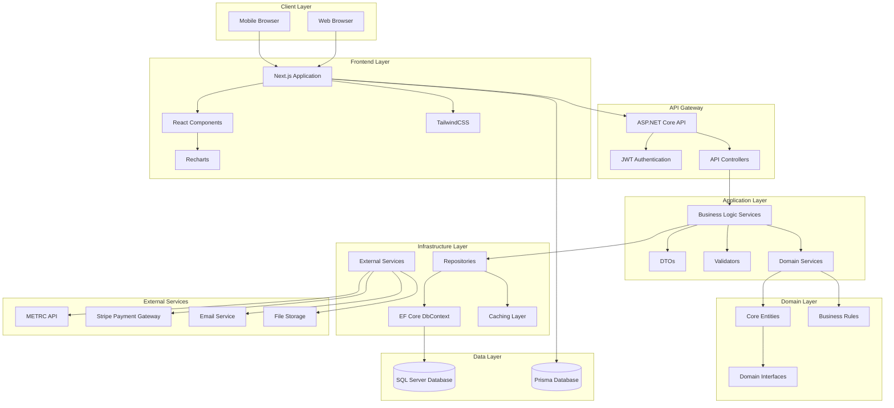
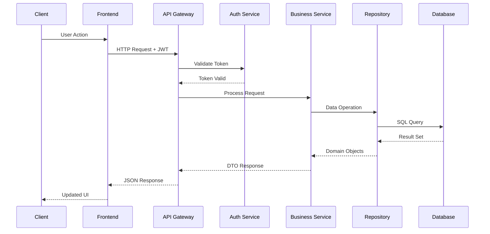
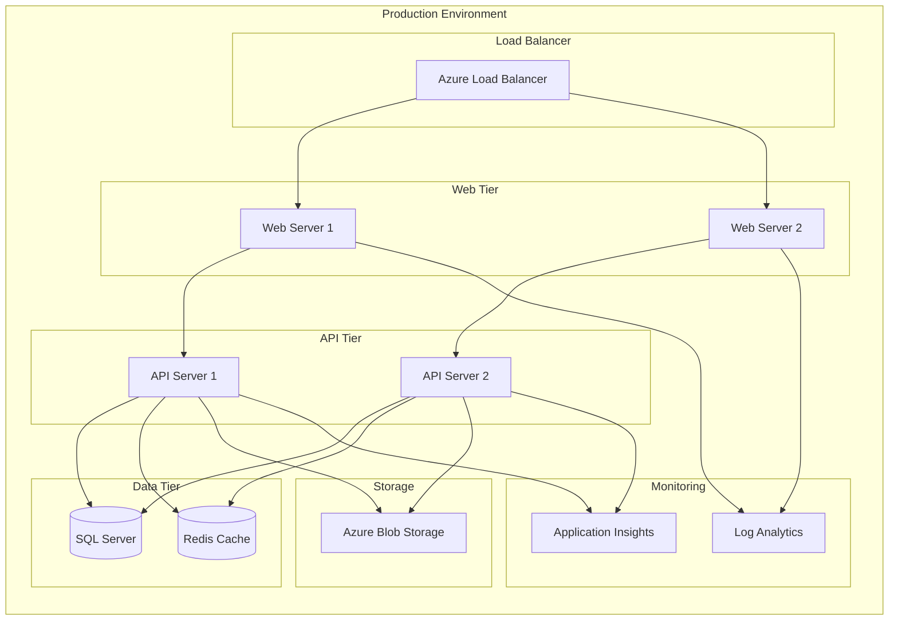
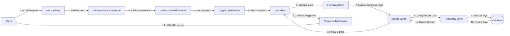
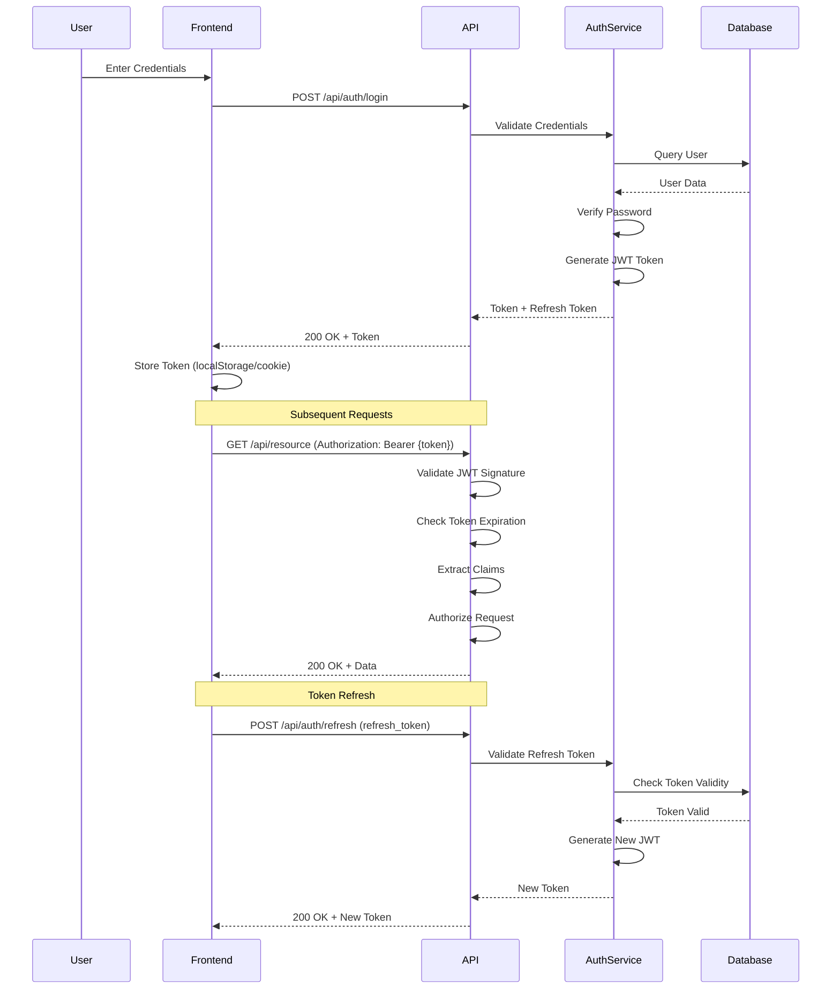
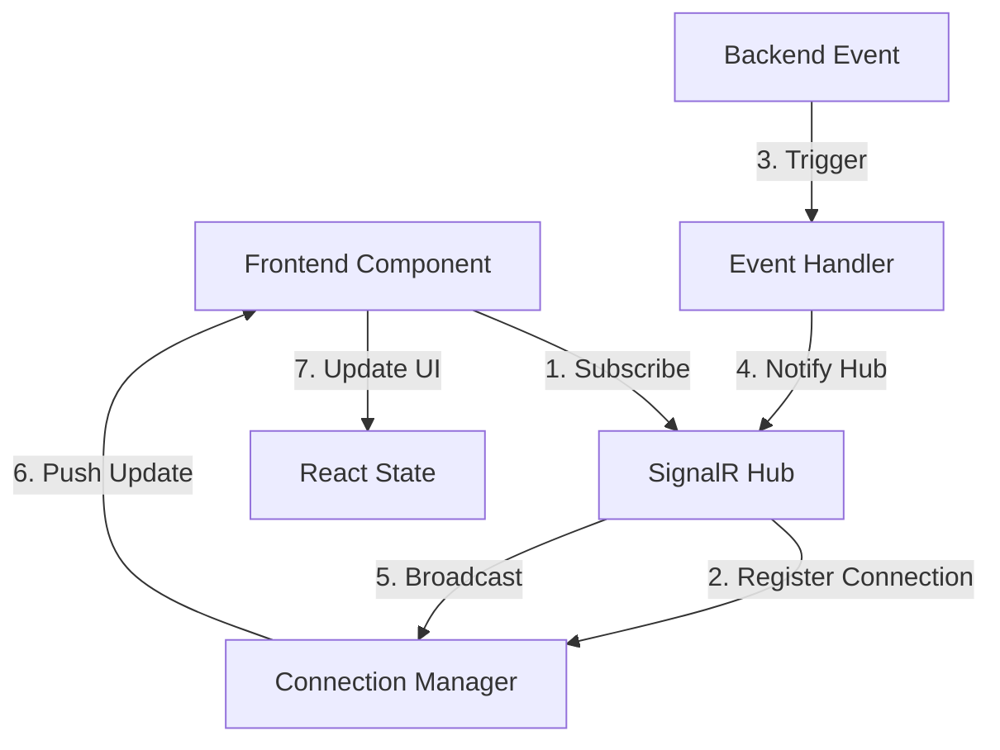
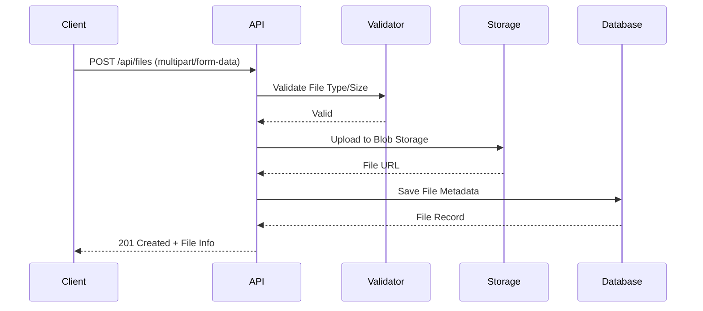
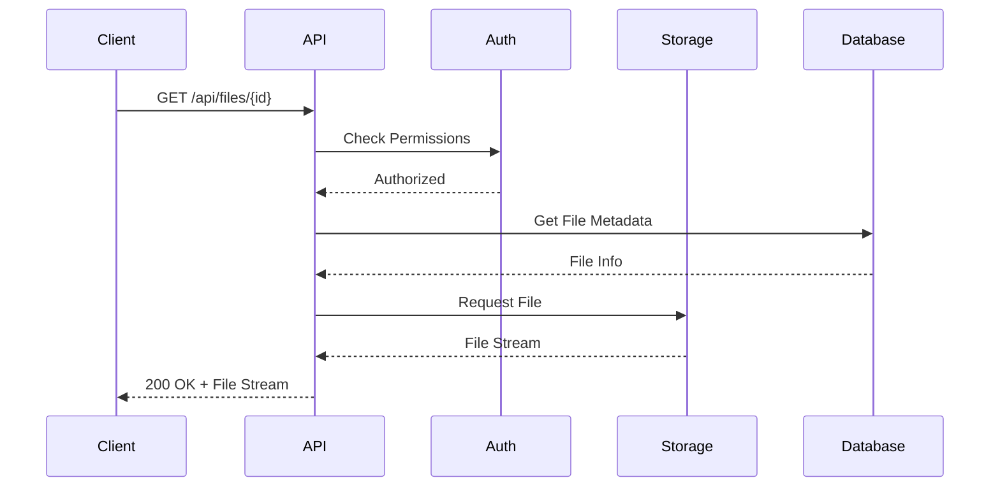
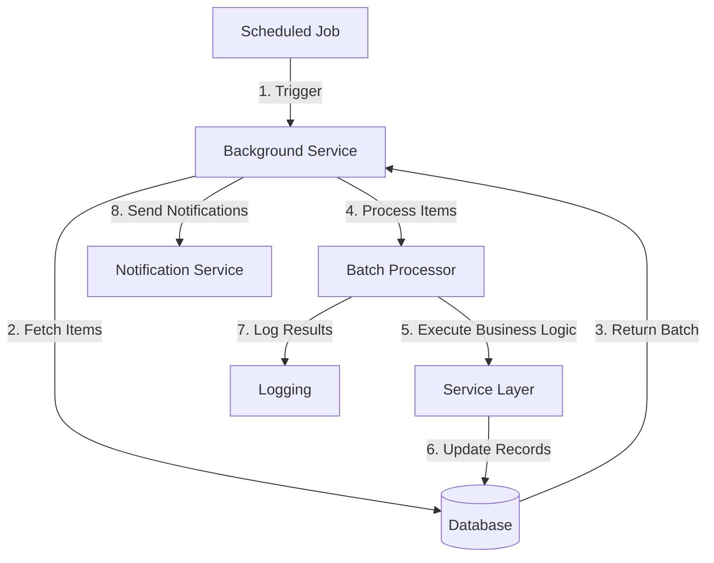
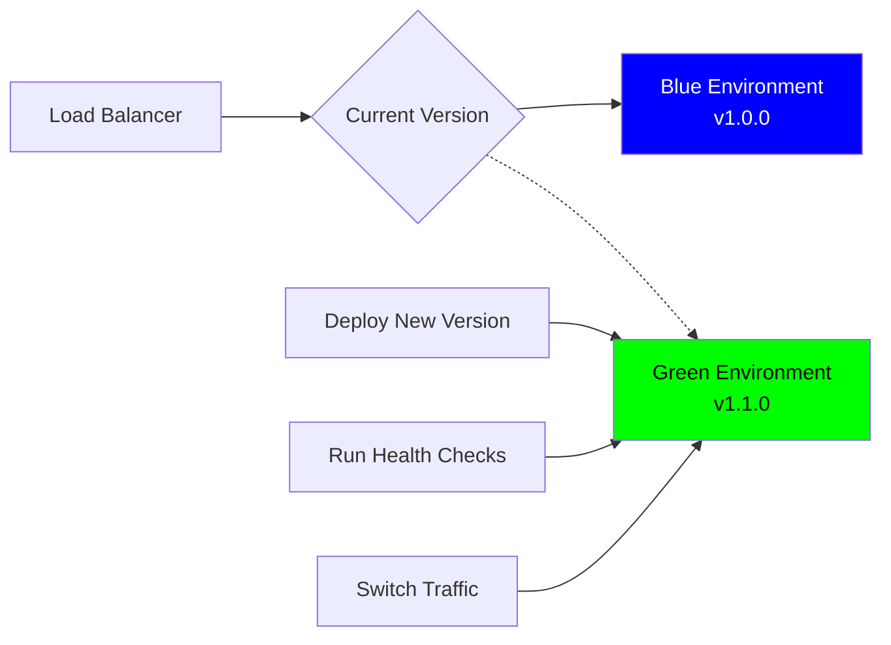

# JERP 3.0 Architecture Documentation

## Overview

JERP 3.0 (Just Enough Resource Planning) is an enterprise-grade ERP system specifically designed for the cannabis industry, featuring comprehensive finance, inventory, compliance, and point-of-sale capabilities. This document provides a complete architectural overview of the system.

---

## 1. System Architecture Diagram

### High-Level Architecture



### Request Flow Architecture



### Deployment Architecture



---

## 2. Technology Stack Overview

### Frontend Technologies

| Component | Technology | Version | Purpose |
|-----------|-----------|---------|---------|
| **Framework** | Next.js | 16.1.6+ | React framework with SSR/SSG |
| **UI Library** | React | 18.2.0+ | Component-based UI |
| **Language** | TypeScript | 5.3.0+ | Type-safe JavaScript |
| **Styling** | TailwindCSS | 3.4.1+ | Utility-first CSS framework |
| **Charts** | Recharts | 2.15.4+ | Data visualization |
| **Forms** | React Hook Form | 7.49.3+ | Form management |
| **Validation** | Zod | 3.22.4+ | Schema validation |
| **Authentication** | NextAuth.js | 4.24.13+ | Authentication for Next.js |
| **State Management** | React Context/Hooks | Built-in | State management |
| **Animations** | Framer Motion | 11.0.3+ | Animation library |
| **Icons** | Lucide React | 0.312.0+ | Icon library |

### Backend Technologies

| Component | Technology | Version | Purpose |
|-----------|-----------|---------|---------|
| **Framework** | ASP.NET Core | 8.0 | Web API framework |
| **Language** | C# | 12.0 | Backend programming language |
| **ORM** | Entity Framework Core | 8.0.0 | Object-relational mapping |
| **Authentication** | JWT Bearer | 8.0.0 | Token-based authentication |
| **API Documentation** | Swagger/OpenAPI | 6.5.0 | API documentation |
| **Validation** | FluentValidation | 11.3.0 | Business rule validation |
| **Logging** | Serilog | 8.0.0 | Structured logging |
| **Health Checks** | HealthChecks | 8.0.0 | Application monitoring |

### Database & Data Layer

| Component | Technology | Version | Purpose |
|-----------|-----------|---------|---------|
| **Primary Database** | Microsoft SQL Server | 2019+ | Relational data storage |
| **ORM (Backend)** | Entity Framework Core | 8.0.0 | .NET data access |
| **ORM (Frontend)** | Prisma | 5.22.0+ | TypeScript data access |
| **Caching** | Redis (planned) | Latest | Distributed caching |
| **Migrations** | EF Core Migrations | 8.0.0 | Database versioning |

### External Integrations

| Service | Purpose | Integration Type |
|---------|---------|------------------|
| **METRC** | Cannabis compliance tracking | REST API |
| **Stripe** | Payment processing | REST API + SDK |
| **Email Service** | Notifications | SMTP/API |
| **Azure Blob Storage** | File storage | SDK |

### DevOps & Infrastructure

| Component | Technology | Purpose |
|-----------|-----------|---------|
| **Version Control** | Git/GitHub | Source code management |
| **CI/CD** | GitHub Actions | Automated deployment |
| **Containerization** | Docker | Application packaging |
| **Orchestration** | Docker Compose | Multi-container management |
| **Cloud Platform** | Azure/AWS | Hosting infrastructure |
| **Monitoring** | Application Insights | Performance monitoring |
| **Error Tracking** | Serilog | Error logging |

---

## 3. Data Flow and Integration Patterns

### 3.1 Request/Response Flow



### 3.2 Authentication Flow (JWT Token Lifecycle)



### 3.3 API Integration Patterns (RESTful APIs)

**Standard REST Endpoints:**

| HTTP Method | Endpoint Pattern | Purpose | Example |
|-------------|------------------|---------|---------|
| GET | `/api/{resource}` | List resources | GET /api/products |
| GET | `/api/{resource}/{id}` | Get single resource | GET /api/products/123 |
| POST | `/api/{resource}` | Create resource | POST /api/products |
| PUT | `/api/{resource}/{id}` | Update resource | PUT /api/products/123 |
| PATCH | `/api/{resource}/{id}` | Partial update | PATCH /api/products/123 |
| DELETE | `/api/{resource}/{id}` | Delete resource | DELETE /api/products/123 |

**Response Format:**
```json
{
  "success": true,
  "data": { /* resource data */ },
  "message": "Operation successful",
  "errors": [],
  "timestamp": "2026-02-05T06:20:00Z"
}
```

### 3.4 Real-Time Data Synchronization



### 3.5 File Upload/Download Flows

**Upload Flow:**


**Download Flow:**


### 3.6 Batch Processing Patterns



---

## 4. Security Architecture

### 4.1 Authentication Mechanisms

#### JWT (JSON Web Tokens)
- **Algorithm:** HMAC-SHA256 (HS256) or RSA-SHA256 (RS256)
- **Token Lifetime:** 60 minutes (access token), 30 days (refresh token)
- **Storage:** HTTP-only cookies (recommended) or localStorage
- **Claims:** User ID, roles, permissions, tenant ID

**JWT Token Structure:**
```json
{
  "header": {
    "alg": "HS256",
    "typ": "JWT"
  },
  "payload": {
    "sub": "user-id",
    "email": "user@example.com",
    "roles": ["Admin", "Finance"],
    "permissions": ["read:invoices", "write:invoices"],
    "tenantId": "tenant-123",
    "exp": 1738742400,
    "iat": 1738738800
  }
}
```

#### OAuth 2.0 (Planned)
- Social login providers (Google, Microsoft)
- Authorization code flow with PKCE
- Third-party integrations

### 4.2 Authorization Patterns

#### Role-Based Access Control (RBAC)
```csharp
[Authorize(Roles = "Admin,Finance")]
public class FinanceController : ControllerBase
{
    [HttpGet]
    [Authorize(Roles = "Admin,Finance,Viewer")]
    public async Task<IActionResult> GetReports() { }
    
    [HttpPost]
    [Authorize(Roles = "Admin,Finance")]
    public async Task<IActionResult> CreateEntry() { }
}
```

#### Claims-Based Authorization
```csharp
[Authorize(Policy = "CanViewFinancialReports")]
public async Task<IActionResult> ViewReports() { }

// Policy Definition
services.AddAuthorization(options =>
{
    options.AddPolicy("CanViewFinancialReports", policy =>
        policy.RequireClaim("permission", "read:financial-reports"));
});
```

#### Resource-Based Authorization
```csharp
// Check if user owns the resource
var invoice = await _invoiceRepository.GetByIdAsync(id);
var authResult = await _authorizationService.AuthorizeAsync(
    User, invoice, "OwnerOnly");
```

### 4.3 Data Encryption

#### At Rest
- **Database Encryption:** Transparent Data Encryption (TDE) for SQL Server
- **File Storage:** Azure Blob Storage encryption enabled
- **Sensitive Fields:** Additional field-level encryption for PII
- **Keys Management:** Azure Key Vault

#### In Transit
- **HTTPS/TLS 1.3:** All API communication encrypted
- **Certificate:** Valid SSL/TLS certificate
- **HSTS:** HTTP Strict Transport Security enabled
- **Perfect Forward Secrecy:** ECDHE cipher suites

### 4.4 CORS Policy

```csharp
services.AddCors(options =>
{
    options.AddPolicy("ProductionPolicy", builder =>
    {
        builder
            .WithOrigins(
                "https://jerp.io",
                "https://app.jerp.io",
                "https://admin.jerp.io"
            )
            .AllowAnyMethod()
            .AllowAnyHeader()
            .AllowCredentials();
    });
});
```

### 4.5 Input Validation and Sanitization

**FluentValidation:**
```csharp
public class CreateInvoiceValidator : AbstractValidator<CreateInvoiceDto>
{
    public CreateInvoiceValidator()
    {
        RuleFor(x => x.CustomerName)
            .NotEmpty()
            .MaximumLength(200)
            .Matches("^[a-zA-Z0-9\\s\\-\\']+$");
        
        RuleFor(x => x.Amount)
            .GreaterThan(0)
            .LessThanOrEqualTo(1000000);
        
        RuleFor(x => x.Email)
            .EmailAddress();
    }
}
```

### 4.6 SQL Injection Prevention

**Entity Framework Core (Parameterized Queries):**
```csharp
// Safe: Parameterized query via EF Core
var products = await _context.Products
    .Where(p => p.Category == category)
    .ToListAsync();

// Safe: FromSqlRaw with parameters
var results = await _context.Products
    .FromSqlRaw("SELECT * FROM Products WHERE Category = {0}", category)
    .ToListAsync();

// NEVER: String concatenation (vulnerable)
// var sql = $"SELECT * FROM Products WHERE Category = '{category}'";
```

### 4.7 XSS Protection

**Frontend:**
- React automatically escapes output
- DOMPurify for sanitizing HTML content
- Content Security Policy (CSP) headers

**Backend:**
```csharp
// CSP Header
app.Use(async (context, next) =>
{
    context.Response.Headers.Add("Content-Security-Policy",
        "default-src 'self'; script-src 'self' 'unsafe-inline' 'unsafe-eval'; style-src 'self' 'unsafe-inline';");
    await next();
});
```

### 4.8 CSRF Protection

**Implementation:**
```csharp
services.AddAntiforgery(options =>
{
    options.HeaderName = "X-CSRF-TOKEN";
    options.Cookie.Name = "CSRF-TOKEN";
    options.Cookie.HttpOnly = true;
    options.Cookie.SecurePolicy = CookieSecurePolicy.Always;
});
```

### 4.9 API Rate Limiting

```csharp
services.AddRateLimiter(options =>
{
    options.GlobalLimiter = PartitionedRateLimiter.Create<HttpContext, string>(context =>
        RateLimitPartition.GetFixedWindowLimiter(
            partitionKey: context.User.Identity?.Name ?? context.Request.Headers.Host.ToString(),
            factory: partition => new FixedWindowRateLimiterOptions
            {
                AutoReplenishment = true,
                PermitLimit = 100,
                Window = TimeSpan.FromMinutes(1)
            }));
});
```

**Rate Limits:**
- Authenticated users: 1000 requests/hour
- Unauthenticated users: 100 requests/hour
- Login endpoint: 5 attempts/15 minutes per IP

### 4.10 Audit Logging

```csharp
public class AuditLog
{
    public int Id { get; set; }
    public string UserId { get; set; }
    public string Action { get; set; }
    public string EntityType { get; set; }
    public string EntityId { get; set; }
    public string OldValues { get; set; }
    public string NewValues { get; set; }
    public string IpAddress { get; set; }
    public DateTime Timestamp { get; set; }
}

// Audit events tracked:
// - User login/logout
// - Data creation, update, deletion
// - Permission changes
// - Configuration changes
// - Failed authentication attempts
// - API access
```

---

## 5. Deployment Architecture

### 5.1 Development Environment Setup

**Local Development Stack:**
```yaml
services:
  # SQL Server
  sqlserver:
    image: mcr.microsoft.com/mssql/server:2019-latest
    ports:
      - "1433:1433"
    environment:
      - ACCEPT_EULA=Y
      - SA_PASSWORD=YourStrong@Passw0rd
  
  # Redis (optional)
  redis:
    image: redis:alpine
    ports:
      - "6379:6379"
  
  # API
  api:
    build: ./src/JERP.Api
    ports:
      - "7001:80"
    depends_on:
      - sqlserver
  
  # Frontend
  frontend:
    build: ./landing-page
    ports:
      - "3000:3000"
    depends_on:
      - api
```

**Developer Checklist:**
- [ ] Install .NET 8.0 SDK
- [ ] Install Node.js 18+
- [ ] Install SQL Server (Express or Developer)
- [ ] Install Docker Desktop (optional)
- [ ] Clone repository
- [ ] Run database migrations
- [ ] Configure environment variables
- [ ] Start backend API
- [ ] Start frontend dev server

### 5.2 Staging Environment Configuration

**Infrastructure:**
- **Hosting:** Azure App Service (Standard tier)
- **Database:** Azure SQL Database (Standard S2)
- **Storage:** Azure Blob Storage (Standard)
- **CDN:** Azure CDN
- **DNS:** Azure DNS or Cloudflare

**Configuration:**
```json
{
  "ConnectionStrings": {
    "DefaultConnection": "Server=staging-sql.database.windows.net;Database=JERP_Staging;..."
  },
  "Logging": {
    "LogLevel": {
      "Default": "Information",
      "Microsoft.AspNetCore": "Warning"
    }
  },
  "AllowedHosts": "staging.jerp.io",
  "JwtSettings": {
    "Secret": "[from-azure-keyvault]",
    "Issuer": "https://staging.jerp.io",
    "Audience": "jerp-staging-api"
  }
}
```

### 5.3 Production Deployment Strategy

**Blue-Green Deployment:**


**Deployment Steps:**
1. Deploy new version to Green environment
2. Run automated tests and health checks
3. Perform smoke testing
4. Gradually shift traffic (10% → 50% → 100%)
5. Monitor error rates and performance
6. Rollback if issues detected
7. Decommission old Blue environment

**Rollback Strategy:**
- Keep previous version running for 24 hours
- Instant rollback by switching load balancer
- Database migrations must be backwards compatible
- Feature flags for gradual rollouts

### 5.4 Database Migration Strategy

**Migration Workflow:**
```bash
# 1. Create migration
dotnet ef migrations add MigrationName --project src/JERP.Infrastructure

# 2. Review migration SQL
dotnet ef migrations script --project src/JERP.Infrastructure

# 3. Test migration in staging
dotnet ef database update --project src/JERP.Infrastructure --connection "Staging"

# 4. Apply to production (automated via CI/CD)
dotnet ef database update --project src/JERP.Infrastructure --connection "Production"
```

**Best Practices:**
- Always create backwards-compatible migrations
- Use SQL transactions for data migrations
- Test rollback procedures
- Keep database and code changes in sync
- Document breaking changes
- Schedule downtime for major migrations

### 5.5 Backup and Disaster Recovery

**Backup Strategy:**

| Component | Frequency | Retention | Method |
|-----------|-----------|-----------|--------|
| Database | Hourly | 30 days | Automated backups |
| Files | Daily | 90 days | Azure Blob snapshots |
| Configuration | On change | Forever | Git repository |
| Secrets | On change | Forever | Azure Key Vault |

**Recovery Time Objectives (RTO):**
- Critical services: 15 minutes
- Standard services: 1 hour
- Non-critical services: 4 hours

**Recovery Point Objectives (RPO):**
- Transactional data: 1 hour
- File uploads: 24 hours
- Configuration: 0 (versioned)

**Disaster Recovery Plan:**
1. Activate DR site (different Azure region)
2. Restore latest database backup
3. Update DNS to point to DR site
4. Verify system functionality
5. Notify stakeholders
6. Monitor for issues
7. Perform post-incident review

### 5.6 Monitoring and Logging Infrastructure

**Application Insights:**
```csharp
services.AddApplicationInsightsTelemetry(options =>
{
    options.ConnectionString = Configuration["ApplicationInsights:ConnectionString"];
    options.EnableAdaptiveSampling = true;
    options.EnableQuickPulseMetricStream = true;
});
```

**Metrics Tracked:**
- Request duration and count
- Failed requests (4xx, 5xx)
- Database query performance
- External API latency
- Custom business metrics (transactions, orders)
- Resource utilization (CPU, Memory, Disk)

**Log Levels:**
- **Trace:** Detailed debugging information
- **Debug:** Developer diagnostics
- **Information:** General informational messages
- **Warning:** Unusual but handled events
- **Error:** Error events requiring attention
- **Critical:** System failures

**Alerting Rules:**
- API response time > 2 seconds
- Error rate > 1%
- Database CPU > 80%
- Disk space < 20%
- Failed login attempts > 10 in 5 minutes

### 5.7 Load Balancing Strategy

**Azure Load Balancer Configuration:**
```yaml
loadBalancer:
  algorithm: round-robin
  healthCheck:
    path: /health
    interval: 30s
    timeout: 10s
    unhealthyThreshold: 3
  
  stickySession:
    enabled: true
    cookieName: JERP-SESSION
    duration: 3600
  
  targets:
    - instance: api-server-1
      weight: 100
    - instance: api-server-2
      weight: 100
```

**Scaling Rules:**
- **Scale Out:** CPU > 70% for 5 minutes → Add instance
- **Scale In:** CPU < 30% for 15 minutes → Remove instance
- **Min Instances:** 2
- **Max Instances:** 10

### 5.8 CDN Configuration

**Azure CDN Settings:**
- **Origin:** Azure Blob Storage for static assets
- **Caching:** Browser cache: 1 day, CDN cache: 7 days
- **Compression:** Enable for text, CSS, JS
- **HTTPS:** Required
- **Custom Domain:** cdn.jerp.io

**Cache Policy:**
```
/assets/images/* → 30 days
/assets/css/* → 7 days
/assets/js/* → 7 days
/api/* → No cache
/*.html → 1 hour
```

### 5.9 Environment Variables Management

**Environment-Specific Configuration:**

**Development (.env.development):**
```env
ASPNETCORE_ENVIRONMENT=Development
ConnectionStrings__DefaultConnection=Server=localhost\SQLEXPRESS;...
JwtSettings__Secret=dev-secret-key-not-for-production
AllowedHosts=localhost
EnableSwagger=true
```

**Production (Azure App Service):**
```env
ASPNETCORE_ENVIRONMENT=Production
ConnectionStrings__DefaultConnection=@Microsoft.KeyVault(SecretUri=...)
JwtSettings__Secret=@Microsoft.KeyVault(SecretUri=...)
AllowedHosts=jerp.io,app.jerp.io
EnableSwagger=false
```

**Security Best Practices:**
- Never commit secrets to Git
- Use Azure Key Vault for production secrets
- Rotate secrets regularly
- Use managed identities for Azure resources
- Implement secret scanning in CI/CD

---

## 6. Performance Optimization

### 6.1 Caching Strategy

**Levels of Caching:**

1. **Browser Cache:** Static assets (images, CSS, JS)
2. **CDN Cache:** Public static content
3. **Application Cache:** Redis for API responses
4. **Database Cache:** Query result caching

**Redis Caching Implementation:**
```csharp
public async Task<Product> GetProductAsync(int id)
{
    var cacheKey = $"product:{id}";
    
    // Try cache first
    var cached = await _cache.GetStringAsync(cacheKey);
    if (cached != null)
    {
        return JsonSerializer.Deserialize<Product>(cached);
    }
    
    // Cache miss - fetch from database
    var product = await _context.Products.FindAsync(id);
    
    // Cache for 1 hour
    await _cache.SetStringAsync(
        cacheKey,
        JsonSerializer.Serialize(product),
        new DistributedCacheEntryOptions
        {
            AbsoluteExpirationRelativeToNow = TimeSpan.FromHours(1)
        }
    );
    
    return product;
}
```

### 6.2 Database Optimization

**Query Optimization:**
```csharp
// Include related data to avoid N+1 queries
var orders = await _context.Orders
    .Include(o => o.Customer)
    .Include(o => o.OrderItems)
        .ThenInclude(oi => oi.Product)
    .Where(o => o.Status == OrderStatus.Pending)
    .ToListAsync();

// Use AsNoTracking for read-only queries
var products = await _context.Products
    .AsNoTracking()
    .Where(p => p.Category == category)
    .ToListAsync();

// Use pagination
var pagedResults = await _context.Invoices
    .OrderByDescending(i => i.CreatedDate)
    .Skip((page - 1) * pageSize)
    .Take(pageSize)
    .ToListAsync();
```

**Indexing Strategy:**
- Primary keys: Clustered indexes
- Foreign keys: Non-clustered indexes
- Frequently queried columns: Non-clustered indexes
- Composite indexes for multi-column queries
- Full-text indexes for search functionality

### 6.3 API Performance

**Response Compression:**
```csharp
services.AddResponseCompression(options =>
{
    options.EnableForHttps = true;
    options.Providers.Add<GzipCompressionProvider>();
    options.Providers.Add<BrotliCompressionProvider>();
});
```

**Async/Await Best Practices:**
- Always use async methods for I/O operations
- Avoid blocking calls (Task.Result, Task.Wait)
- Use ConfigureAwait(false) in library code

---

## 7. Scalability Considerations

### Horizontal Scaling
- Stateless API design
- Load balancer distribution
- Database read replicas
- Distributed caching

### Vertical Scaling
- Increase server resources
- Optimize code and queries
- Database tuning
- Connection pooling

### Future Architecture Enhancements
- Microservices architecture
- Event-driven architecture
- CQRS pattern
- Message queue (RabbitMQ/Azure Service Bus)
- GraphQL API

---

## Conclusion

JERP 3.0 is built on a solid architectural foundation with modern technologies, comprehensive security measures, and scalable deployment strategies. This architecture supports the current business requirements while providing flexibility for future growth and enhancements.

For additional information, see:
- [Project Scope of Work](../SOW.md)
- [Developer Onboarding Guide](../ONBOARDING.md)
- [API Documentation](../../API-DOCUMENTATION.md)
